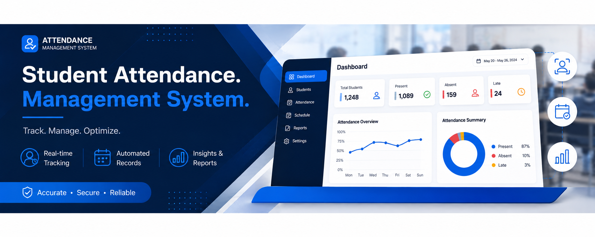

<p align="center">
  
</p>

<h1 align="center">Student Attendance Management System</h1>

<p align="center">
  A centralized web-based platform for managing student attendance.
</p>

## Project Description

The **Student Attendance Management System** is a web-based application designed to modernize and simplify student attendance recording, monitoring, and reporting. The system provides a centralized platform where administrators can manage academic records, instructors can record and monitor attendance, and students can view their classes and personal attendance records.

The system has three main user roles:

- **Admin** – manages students, instructors, courses, departments, subjects, classes, enrollment, attendance reports, notifications, and system activity.
- **Instructor** – manages assigned classes, student lists, attendance, check-ins, schedules, and attendance reports.
- **Student** – views enrolled classes, attendance history, attendance reports, and performs self-attendance check-in when enabled.

---

## Team Members

- **Repo Lead** — Neil Herbert U. Betacura
- **Board Lead** — Alondra Makala
- **Scribe** — Jannie Galido
- **Builder** — Angelica Coron
- **Builder** — Angelo Dairo

---

## CRUD Operations

- **Create** — Add students, instructors, classes, subjects, users, enrollment, and attendance records.
- **Read** — View student information, instructor information, classes, schedules, attendance history, and reports.
- **Update** — Edit student, instructor, class, schedule, and attendance information.
- **Delete** — Remove or deactivate outdated or incorrect records when authorized.

---

## Related Record Types

1. **Students**
   - Student ID
   - Student Name
   - Course
   - Year Level
   - Account Status

2. **Instructors**
   - Instructor ID
   - Instructor Name
   - Department
   - Assigned Subjects
   - Account Status

3. **Classes**
   - Class ID
   - Subject
   - Instructor
   - Schedule
   - Enrolled Students

4. **Attendance Records**
   - Attendance ID
   - Student
   - Class/Subject
   - Date
   - Time
   - Attendance Status

---

## Main Features

### Admin

- Admin Dashboard
- Absence Notifications
- Student Management
- Student User Management
- Instructor Management
- Course Management
- Department Management
- Subject Management
- Class Management
- Class Enrollment
- Pending Student Registrations
- Student Attendance Reports
- Take Attendance
- System Activity Logs

### Instructor

- Instructor Dashboard
- Instructor Classes
- Class Schedule
- Student List
- Student Check-ins
- Take Attendance
- Attendance History
- Class Attendance Reports
- Profile Settings

### Student

- Student Dashboard
- Enrolled Classes
- Self Attendance Check-In
- Attendance History
- Attendance Reports
- Profile Settings

---

## Repository Structure

```text
Student-Attendance-Management-System/
│
├── README.md
├── .gitignore
│
├── docs/
   │
   ├── backlog.md
   │
   ├── ai-notes/
   │   └── deliverables-1.md
   │
   └── wireframes/
       │
       ├── login.png
       │
       ├── admin/
       │   ├── absence-notifications.png
       │   ├── attendance-history.png
       │   ├── class-enrollment.png
       │   ├── class-management.png
       │   ├── courses.png
       │   ├── dashboard.png
       │   ├── department.png
       │   ├── instructor-management
       │   ├── pending-student-registrations.png
       │   ├── profile-settings.png
       │   ├── student-attendance-report.png
       │   ├── student-management.png
       │   ├── student-user-management.png
       │   ├── subjects.png
       │   ├── system-activity-logs.png
       │   └── system-configuration.png
       │
       ├── instructor/
       │   ├── attendance-history.png
       │   ├── class-attendance-report.png
       │   ├── classes.png
       │   ├── dashboard.png
       │   ├── profile-settings.png
       │   ├── schedule.png
       │   ├── students-check-in.png
       │   └── students-list.png
       │
       ├── student/
       │   ├── attendance-history.png
       │   ├── attendance-report.png
       │   ├── dashboard.png
       │   ├── enrolled-class.png
       │   ├── profile-settings.png
       │   └── self-attendance-check-in.png
       │
       └── states/
           ├── empty-state.png
           ├── error-state.png
           ├── loading-state.png
           ├── success-state.png
           └── delete-confirmation.png

  ## Technology Stack
- **Frontend:** HTML5, CSS3, JavaScript, Bootstrap 5
- **Backend:** Python
- **Database:** MySQL
- **Version Control:** Git & GitHub
- **Development Environment:** MySQL
- **Code Editor:** Visual Studio Code
