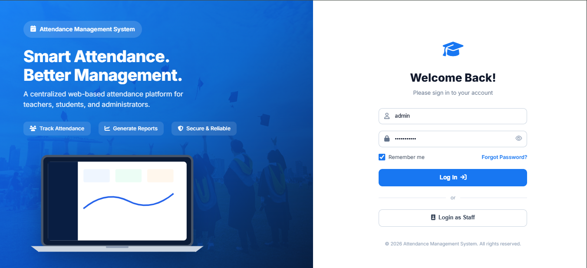

# STUDENT-ATTENDANCE-MANAGEMENT-SYSTEM

A web-based Student Attendance Management System developed to help educational institutions and tutoring centers manage students, instructors, classes, roll calls, academic schedules, and reports efficiently.

---

## Project Description

Traditional attendance recording at academic tutoring centers and secondary schools often relies on paper sign-in sheets, making it difficult for instructors to review attendance history or for the center to identify students who are frequently absent. The **Student Attendance Management System (SAMS)** is a web-based application that gives instructors a simple digital way to record daily attendance per class, and gives the center admin a way to manage students, classes, and view attendance summaries — replacing the paper process with a centralized, searchable system.

The system features two main user roles:
* **Admin** — Manages students, instructors, classes, and views attendance reports across the center.
* **Instructor** — Manages assigned classes, takes attendance per session, and reviews attendance history for their classes.

*(Note: A student self-service portal was considered but deferred to keep the project scope strictly achievable within the 12-week schedule).*

---

## Problem Statement

Academic institutions and learning centers that manage attendance manually experience significant difficulties in tracking student participation, maintaining accurate records, and identifying chronic absenteeism. Manual recording on paper log sheets is error-prone, easily damaged or lost, and requires cumbersome manual tallying to produce reports. The Student Attendance Management System provides a centralized, secure web-based solution for managing student profiles, faculty assignments, classroom roll calls, and real-time attendance analytics, drastically reducing administrative burden and ensuring data integrity.

---

## Primary Record Types

* **Students** — Records student profiles, cohort enrollments, emergency guardian contacts, and cumulative attendance rates.
* **Instructors** — Records instructor details, assigned classes, subject departments, and system credentials.
* **Classes** — Records academic course sections, assigned faculty, room allocations, and schedules.
* **Attendance Records** — Records date-stamped roll call marks (`Present`, `Absent`, `Late`, `Excused`), remarks, and audit timestamps.

---

## 👥 Team Members

| Name | Role | Responsibilities |
|---|---|---|
| **Neil Herbert U. Betacura** | Repository Lead | Managed the GitHub repository, reviewed and merged pull requests, coordinated team collaboration. |
| **Demelyn Concepcion** | Board Lead | Managed the GitHub Project Board, created and organized issues, and tracked task progress. |
| **Jamaica Ganolon** | Scribe | Prepared project documentation, user stories, backlog, and meeting notes. |
| **Angelo Dairo** | Builder | Developed project features, implemented assigned tasks, and contributed code. |
| **Angelo Madolaria** | Builder | Developed project features, implemented assigned tasks, and contributed code. |

---

## 🎯 Objectives

* **Simplify Attendance Management**: Replace tedious physical sheets with a fast, modern digital interface.
* **Reduce Manual Record-Keeping**: Eliminate paper waste, data entry delays, and manual calculation errors.
* **Real-Time Absence Monitoring**: Detect consecutive absences and notify administrators immediately.
* **Improve Data Accuracy**: Centralize records with validation rules and audit logs.
* **Actionable Reporting**: Generate visual charts and CSV exports for school administration and faculty reviews.

---

## 🔄 CRUD Requirements & Matrix

| Record | Create | Read | Update | Delete |
|---|:---:|:---:|:---:|:---:|
| **Students** | ✓ | ✓ | ✓ | ✓ |
| **Instructors / Users** | ✓ | ✓ | ✓ | ✓ |
| **Classes** | ✓ | ✓ | ✓ | ✓ |
| **Attendance Records** | ✓ | ✓ | ✓ | Controlled |

---

## ✨ Features

### 👨‍🎓 Student Management
* Add new students with full demographic profiles, strands, and emergency guardian contact details
* View searchable students directory with interactive pagination (10 per page)
* Edit student records, contact numbers, and medical/guidance notes
* Delete student records with safety confirmation modal
* Filter students by grade level, section, strand, and enrollment status (`Active` / `Inactive`)
* Student photo upload dropzone with instant preview
* View student detail modal with individual attendance rate progress bars

### 📋 Attendance & Roll Call
* Live roll call recording filtered by class cohort, date, and subject
* Segmented status toggle buttons (`Present`, `Absent`, `Late`) with live color indicators
* Active **Load Students** button with animated loading spinner and dynamic roster retrieval
* Instant batch actions: **Mark All Present** and **Clear All**
* Live KPI status counter recalculation (Total Students, Present count + %, Absent count + %, Late count + %)
* Empty-state fallback for classes without enrolled students with an "Enroll Student Now" shortcut
* Commit and save attendance session with automatic session history logging

### 🕒 Attendance History Logs
* View historical attendance logs with class names, dates, attendance counts, and rates
* One-click **Load** button to reload historical session parameters into the roll call table
* Export attendance history logs to CSV format

### 🏫 Class Management
* Register new academic classes with subjects, rooms, and assigned instructors
* Interactive class roster grid displaying enrolled student count and average attendance
* Inspect class roster modal (`Class Roster`) displaying enrolled students and individual attendance rates
* Direct **Take Attendance** shortcut from class card

### 📅 Academic Calendar & Scheduling
* Interactive monthly academic calendar with previous/next navigation and **Today** jump shortcut
* Schedule academic events, midterms, faculty meetings, holidays, and report deadlines
* Category color tags (`Class`, `Exam`, `Meeting`, `Holiday`, `Deadline`)
* Upcoming events list with date badges and deletion controls

### 👥 User Accounts & Role-Based Access Control
* Manage system users (Administrators, Instructors, Staff)
* Add and edit user accounts with assigned academic departments
* Reset user passwords with temporary security keys
* Toggle account active/inactive status
* Role-specific permission badges and active session timestamps

### 📊 Reports & Analytics
* Weekly attendance trend SVG vector line chart with interactive data points and tooltips
* Overall attendance summary SVG donut chart with percentage breakdown
* Class attendance summary table with cohort averages
* Top & low attendance ranking leaderboard
* Real-time KPI summary cards (Total Students, Present Today, Absent Today, Active Classes)

### ⚙️ System Settings & Policies
* Attendance policy configuration (cutoff time, late grace periods, consecutive absence alert thresholds)
* Retroactive edit permission toggle and automatic daily 5:00 PM session lock
* Automated guardian alert configuration with **Simulate Guardian SMS Alert** modal and live preview
* Center profile management (institutional name, term, campus address, crest badge upload)
* Real-time **System Health Diagnostics** modal (Persistence, REST API, Cache, Latency)
* Data storage operations: Export full JSON backup, Import JSON database, Purge logs, Reset seed defaults

### 💾 Data Export & Backup Engine
* Export students directory to CSV (`sams_students_roster.csv`)
* Export roll call attendance report to CSV (`sams_attendance_report.csv`)
* Export user accounts directory to CSV (`sams_users_directory.csv`)
* Full database JSON backup and restore (`sams_database_backup_YYYY-MM-DD.json`)

---

## 📂 Repository Structure

```
Student-Attendance-Management-System/
│
├── README.md
├── .env.example
├── .gitignore
├── package.json
├── server.py
├── server.js
│
├── data/
│   └── seed_data.json
│
├── docs/
│   ├── backlog.md
│   ├── study_guide_defense.docx
│   ├── presentation_slides.pptx
│   └── wireframes/
│       ├── login.png
│       ├── admin/
│       │   ├── dashboard.png
│       │   ├── student-management.png
│       │   ├── instructor-management.png
│       │   ├── class-management.png
│       │   └── attendance-report.png
│       ├── instructor/
│       │   ├── dashboard.png
│       │   ├── classes.png
│       │   ├── take-attendance.png
│       │   ├── attendance-history.png
│       │   └── profile-settings.png
│       └── states/
│           ├── empty-state.png
│           ├── error-state.png
│           ├── loading-state.png
│           ├── success-state.png
│           └── delete-confirmation.png
│
├── public/
│   ├── index.html
│   ├── style.css
│   └── app.js
│
├── src/
│   ├── controllers.py
│   ├── guards.py
│   ├── pipeline.py
│   ├── repository.py
│   ├── router.py
│   ├── stub_router.py
│   ├── thin_controllers.py
│   └── validation.py
│
└── tests/
    ├── test_core_api.py
    ├── test_week3_stubs.py
    ├── test_week4_guards.py
    ├── test_week5_controllers.py
    ├── test_week10_qa.py
    └── test_week11_fixes.py
```

---

## 🛠️ Technology Stack

* **Frontend**: HTML5, CSS3 (Custom Responsive Design System matching 10 high-fidelity designs), Vanilla JavaScript (ES6+), FontAwesome 6
* **Backend**: Python 3 (Native HTTP REST Server, Thread-safe Repository, Validation Guards) / Node.js
* **Persistence**: Atomic JSON Document Store / In-Memory State Layer with LocalStorage Sync
* **Version Control**: Git & GitHub
* **Code Editor**: Visual Studio Code

---

## 📷 System Screenshots

| Screen | Description / Wireframe |
|---|---|
| **Login View** | Authentication screen with role-based sign-in<br> |
| **Admin Dashboard** | Main analytics dashboard with line and donut charts<br> |
| **Students Directory** | Searchable roster with progress bars and pagination<br> |
| **Create Student Form** | Student enrollment with photo uploader<br> |
| **Edit Student Profile** | Modal and view for updating student records<br> |
| **Delete Confirmation Modal** | Safety modal before deleting student records<br> |
| **Roll Call (Take Attendance)** | Daily attendance marking with segmented status buttons<br> |
| **Attendance History Logs** | Past session logs modal with CSV export<br> |
| **Class Management & Roster** | Class grid and enrollment roster modal<br> |
| **Academic Calendar** | Monthly schedule with event categories and jump to today<br> |
| **User Accounts & Roles** | Administrator, Instructor, and Staff role management<br> |
| **Empty State** | Fallback display when zero records match filters<br> |
| **Error State** | Graceful error recovery screen<br> |
| **System Settings & Policies** | Cutoff times, alert policies, and branding<br> |
| **System Diagnostics Modal** | Live health check for database and API latency<br> |

---

## 🚀 Future Improvements

* 📲 **Biometric Fingerprint / RFID Card Scanner**: Automated student tap-in/tap-out at the school entrance.
* 📱 **Mobile Check-in Application**: Dedicated mobile app for students and parents.
* 💬 **Real-Time SMS Gateway**: Direct integration with Twilio / Semaphore for instant SMS absence delivery.
* 🏷️ **QR Code Attendance Badges**: Instant scanning using webcam or mobile phone camera.
* 🏢 **Multi-Branch Campus Architecture**: Centralized reporting for multi-campus school branches.

---

## 🧪 Testing

### How to Run Automated Tests

1. Open the project directory in Command Prompt or terminal.
2. Ensure Python 3 is installed.
3. Run the automated test suite using Python's `unittest` runner:
   ```bash
   python -m unittest discover -s tests -p "test_*.py"
   ```

`python -m unittest` executes all 50 automated tests in the `tests/` directory to verify that the application's repository layer, route guards, validation logic, and controller endpoints work correctly and that changes have not introduced regressions.

**Expected Output:**
```
..................................................
----------------------------------------------------------------------
Ran 50 tests in 0.007s

OK
```

---

## 🚀 Local Run Instructions

The application runs a lightweight, zero-dependency Python HTTP server that serves both the static frontend and REST API endpoints.

### 1. Configure the Environment (Optional)
Create or update `.env` (or copy `.env.example`) with your local preferences:
```env
PORT=8000
HOST=127.0.0.1
APP_DEBUG=False
```

### 2. Start the Server
Run the unified Python server:
```bash
python server.py
```
*(Alternatively, run via Node.js with `node server.js`)*

### 3. Open the Application
Open your browser and navigate to:
👉 **[http://localhost:8000](http://localhost:8000)** (or `http://127.0.0.1:8000`)

### 4. Default Login Credentials
* **Email**: `admin@sams.edu.ph`
* **Password**: `admin123` (or click **"Sign In"**)

### 5. Verification Checklist
With the server running:
* **Dashboard**: Verify KPI cards, attendance trend line chart, and donut summary chart.
* **Students Directory**: Test search, class filtering, student creation, editing, and deletion.
* **Attendance Roll Call**: Select a class, test the **Load Students** button, toggle `Present`/`Absent`/`Late`, and click **Save Attendance**.
* **Attendance History**: Open Attendance History modal, verify past logs, and test **Export Log (CSV)**.
* **Academic Calendar**: Navigate months, click **Today**, and add a scheduled calendar event.
* **System Settings**: Test **System Diagnostics** modal, test **Send Test Notification**, and export/import the database JSON backup.
